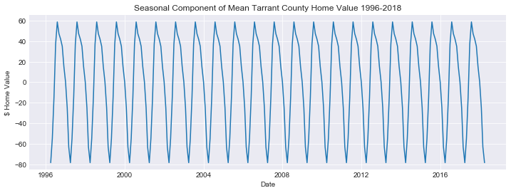
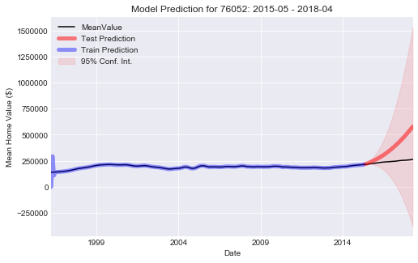

# Mod 4 Project: Zillow Housing Data Time Series Modeling & Forecasting

Student: Doug Steen

Instructor: James Irving, PhD

Cohort: ds_ft_10072019

Project Review Date: 1/18/2020

## Background & Purpose

A fictional real estate investment company has requested assistance with the following question:

- What are the five best zip codes to invest in?

For this study, I am using a Zillow Housing Dataset, obtained from Zillow's research page (https://www.zillow.com/research/data/). The raw dataset is located in this repository ('zillow_data.csv'). This dataset contains monthly average home values for nearly every zip code in the U.S., with most zip codes having data from 1996 - 2018.

### Target Region: Tarrant County, TX

The scope of this analysis is limited to the zip codes in Tarrant County, Texas which have available measurements for the full data range (1996 - 2018). Tarrant County encompasses the western portion of the Dallas-Fort Worth (DFW) Metroplex, and most notably contains the cities of Fort Worth and Arlington.
    
### Method

Modeling and forecasting of home values using ARIMA (Auto-regressive Integrated Moving Average) time series analysis techniques.

### Selection Criteria:

The five 'best' zip codes for investment in Tarrant County will be selected based on the following criteria:
    
-3 year forecasted return on investment (ROI)
    
-Confidence interval of the ROI forecast
    
-Quality of model prediction using a train-test split of Zillow data


## Import Libraries / Packages


```python
# Import cohort package
#!pip install -U fsds_100719
import warnings
from fsds_100719.imports import *
import itertools
import statsmodels.api as sm
from statsmodels.tsa.seasonal import seasonal_decompose
from statsmodels.tsa.stattools import adfuller
from statsmodels.graphics.tsaplots import plot_acf, plot_pacf
from tqdm import tqdm_notebook

# Display all columns of large dataframes
pd.set_option('display.max_columns', 0)

# Ignore warnings
warnings.filterwarnings('ignore')

# Set default plot style
plt.style.use('seaborn-darkgrid')
%matplotlib inline
```

    fsds_1007219  v0.6.4 loaded.  Read the docs: https://fsds.readthedocs.io/en/latest/ 
    


<style  type="text/css" >
</style><table id="T_8c95df24_3981_11ea_9e55_24ee9a2cffaf" ><caption>Loaded Packages and Handles</caption><thead>    <tr>        <th class="col_heading level0 col0" >Handle</th>        <th class="col_heading level0 col1" >Package</th>        <th class="col_heading level0 col2" >Description</th>    </tr></thead><tbody>
                <tr>
                                <td id="T_8c95df24_3981_11ea_9e55_24ee9a2cffafrow0_col0" class="data row0 col0" >dp</td>
                        <td id="T_8c95df24_3981_11ea_9e55_24ee9a2cffafrow0_col1" class="data row0 col1" >IPython.display</td>
                        <td id="T_8c95df24_3981_11ea_9e55_24ee9a2cffafrow0_col2" class="data row0 col2" >Display modules with helpful display and clearing commands.</td>
            </tr>
            <tr>
                                <td id="T_8c95df24_3981_11ea_9e55_24ee9a2cffafrow1_col0" class="data row1 col0" >fs</td>
                        <td id="T_8c95df24_3981_11ea_9e55_24ee9a2cffafrow1_col1" class="data row1 col1" >fsds_100719</td>
                        <td id="T_8c95df24_3981_11ea_9e55_24ee9a2cffafrow1_col2" class="data row1 col2" >Custom data science bootcamp student package</td>
            </tr>
            <tr>
                                <td id="T_8c95df24_3981_11ea_9e55_24ee9a2cffafrow2_col0" class="data row2 col0" >mpl</td>
                        <td id="T_8c95df24_3981_11ea_9e55_24ee9a2cffafrow2_col1" class="data row2 col1" >matplotlib</td>
                        <td id="T_8c95df24_3981_11ea_9e55_24ee9a2cffafrow2_col2" class="data row2 col2" >Matplotlib's base OOP module with formatting artists</td>
            </tr>
            <tr>
                                <td id="T_8c95df24_3981_11ea_9e55_24ee9a2cffafrow3_col0" class="data row3 col0" >plt</td>
                        <td id="T_8c95df24_3981_11ea_9e55_24ee9a2cffafrow3_col1" class="data row3 col1" >matplotlib.pyplot</td>
                        <td id="T_8c95df24_3981_11ea_9e55_24ee9a2cffafrow3_col2" class="data row3 col2" >Matplotlib's matlab-like plotting module</td>
            </tr>
            <tr>
                                <td id="T_8c95df24_3981_11ea_9e55_24ee9a2cffafrow4_col0" class="data row4 col0" >np</td>
                        <td id="T_8c95df24_3981_11ea_9e55_24ee9a2cffafrow4_col1" class="data row4 col1" >numpy</td>
                        <td id="T_8c95df24_3981_11ea_9e55_24ee9a2cffafrow4_col2" class="data row4 col2" >scientific computing with Python</td>
            </tr>
            <tr>
                                <td id="T_8c95df24_3981_11ea_9e55_24ee9a2cffafrow5_col0" class="data row5 col0" >pd</td>
                        <td id="T_8c95df24_3981_11ea_9e55_24ee9a2cffafrow5_col1" class="data row5 col1" >pandas</td>
                        <td id="T_8c95df24_3981_11ea_9e55_24ee9a2cffafrow5_col2" class="data row5 col2" >High performance data structures and tools</td>
            </tr>
            <tr>
                                <td id="T_8c95df24_3981_11ea_9e55_24ee9a2cffafrow6_col0" class="data row6 col0" >sns</td>
                        <td id="T_8c95df24_3981_11ea_9e55_24ee9a2cffafrow6_col1" class="data row6 col1" >seaborn</td>
                        <td id="T_8c95df24_3981_11ea_9e55_24ee9a2cffafrow6_col2" class="data row6 col2" >High-level data visualization library based on matplotlib</td>
            </tr>
    </tbody></table>


## Functions
melt_data: Converts the raw Zillow housing data df from long to wide format (making it more time series-friendly)

arima_grid_search: Finds best fit ARIMA/SARIMA model orders (pdq(s)) for a zip code based on minimizing the AIC

predict_arima: Makes an ARIMA prediction on test portion of a time series, calculates metrics MAPE and R^2 to evaluate fit

forecast_arima: Makes an ARIMA forecast into future beyond a time series, calculates ROI and 95% CL of ROI over given period

### melt_data


```python
def melt_data(df):  # formerly called it melt_data_student with REED
    """
    Melts Zillow Home MeanValue dataframe from long to wide format, in preparation for time series analysis.

    Parameters
    ----------
    df : dataframe
        Zillow dataframe to be converted to wide format

    Returns
    -------
    Melted (wide format) dataframe
    """

    melted = pd.melt(df, id_vars=['RegionID', 'RegionName', 'City', 'State', 'Metro', 'CountyName',
                                  'SizeRank'], var_name='Month', value_name='MeanValue')
    melted['Month'] = pd.to_datetime(melted['Month'], format='%Y-%m')
    melted = melted.dropna(subset=['MeanValue'])

    return melted
```

### arima_grid_search


```python
def arima_grid_search(df, zip_code, p, d, q, seasonal=False, train_test=True,
                      train_end='2015-04', show_iters=False):
    """Performs a grids search for optimized pdq(s) orders for fitting a best ARIMA or SARIMA model to Zillow time series by minimizing AIC.

    Parameters
    ----------
    df : dataframe
        dataframe containing time series data (can also include other columns)
    zip_code : int
        zip code to fit the ARIMA or SARIMA model
    p: range or array-like
        AR (p) orders to provide to grid search
    d: range or array-like
        Differencing (d) orders to provide for grid search
    q: range or array-like
        MA (q) orders to provide for grid search
    seasonal : bool
        If True, allows for incorporation of seasonal modeling components with SARIMA
        (Default = False)
    train_test : bool
        If True, specifies that the model should be fit to the train portion of a train-test split of time series.
        If False, model is fit to the entire time series provided.
        (Default = True)
    train_end : str
        Date to mark the end of the training data split (this assumes that test data will be only most recent data)
        (Default = '2015-04')
    show_iters : bool
        If True, prints AIC for each iteration through combinations of model orders
        (Default=False)

    Returns
    -------
    Zip code of selected time series, pdq(s) orders and AIC of the best fit model.
    """
    import statsmodels.api as sm
    from tqdm import tqdm_notebook
    import itertools

    # Generate all different combinations of p, q and q triplets
    pdq = list(itertools.product(p, d, q))

    # Get only time series object for specified zip code
    df_zip = df.loc[df['RegionName'] == zip_code]

    ts_zip = df_zip.drop(['RegionID', 'RegionName', 'City',
                          'State', 'Metro', 'CountyName', 'SizeRank'], axis=1)

    ts_zip.set_index('Month', inplace=True)

    # If arima model is being fit as part of a train-test split, define correct training interval
    if train_test:
        ts_zip = ts_zip[:train_end]

    results = []
    
    # If seasonal is False, SARIMAX function will run as an ARIMA model
    if seasonal == False:
        for i in tqdm_notebook(pdq, desc=f'{zip_code} Grid Search Progress'):
            # Try - except to move to next possibility if model cannot envforce stationarity/invertibility
            try:
                model = sm.tsa.SARIMAX(ts_zip, order=i)
                out = model.fit()
                aic = out.aic
                results.append([i, aic])
            except:
                continue
            # Print results of each grid search iteration if show_iters is True
            if show_iters == True:
                print([i, aic])
                
        # Place all results into a dataframe, and return only the minimum result
        results_df = pd.DataFrame(results, columns=['pdq', 'aic'])
        min_result = results_df.loc[results_df['aic'].idxmin()]
        return zip_code, min_result
    
    # If seasonal is True, function runs as a SARIMA model, and PDQs are considered for seasonal componenet
    else:
        pdqs = [(x[0], x[1], x[2], 12) for x in pdq]
        for i in tqdm_notebook(pdq, desc=f'{zip_code} Grid Search Loop Progress'):
            for j in tqdm_notebook(pdqs, desc=f'{zip_code} Grid Search Sub-Loop Progress'):
                # Try - except to move to next possibility if model cannot envforce stationarity/invertibility
                try:
                    model = sm.tsa.SARIMAX(ts_zip, order=i, seasonal_order=j)
                    out = model.fit()
                    aic = out.aic
                    results.append([i, j, aic])
                except:
                    continue
                # Print results of each grid search iteration if show_iters is True   
                if show_iters == True:
                    print([i, j, aic])
        
        # Place all results into a dataframe, and return only the minimum result
        results_df = pd.DataFrame(results, columns=['pdq', 'pdqs', 'aic'])
        min_result = results_df.loc[results_df['aic'].idxmin()]
        return zip_code, min_result
```

### predict_arima


```python
def predict_arima(df, zip_code, train_end, test_begin, test_end, pdq, plot=False):
    """Fits an ARIMA model to training data and makes a prediction on testing data for a given zip code's time series data. Returns MAPE
    and R^2 of model test predictions.

    Parameters
    ----------
    df : pandas dataframe
        Dataframe containing desired time series data for all zip codes
    zip code : int
        Desired zip code for model fit and prediction
    train_end : str
        Date to signify end of training (model fit) portion (Assumed that training data is at beginning of ts)
    test_begin : str
        Date to signify beginning of test portion (Model predictions will begin with this date to end of time series)
    test_end : str
        Date to signify end of test portion (Model predictions will end with this date in time series)
    pdq : tuple
        Tuple of the form (p, d, q) to serve as ARIMA model parameters
    plot : bool
        If True, also returns plot of time series and model prediction with 95% conf interval
        (Default = False)

    Returns
    -------
    Summary dataframe containing the zip code, pdq orders, and MAPE / R^2 of model test predictions.
    """
    import statsmodels.api as sm
    from sklearn.metrics import r2_score

    # Get only time series object for specified zip code
    df_zip = df.loc[df['RegionName'] == zip_code]

    ts_zip = df_zip.drop(['RegionID', 'RegionName', 'City',
                          'State', 'Metro', 'CountyName', 'SizeRank'], axis=1)

    ts_zip.set_index('Month', inplace=True)

    # Define train and test subsets of time series
    ts_zip_train = ts_zip.loc[:train_end]
    ts_zip_test = ts_zip.loc[test_begin:]

    mod = sm.tsa.SARIMAX(ts_zip_train, order=pdq)
    output = mod.fit()

    # Get predictions for test portion of data
    pred_test = output.get_prediction(start=test_begin, end=test_end)
    pred_train = output.get_prediction(start='1996-04', end='2015-04')
    
    pred_conf = pred_test.conf_int()

    # Model prediction performance on test data
    y_hat_test = pred_test.predicted_mean.values
    y_hat_train = pred_train.predicted_mean.values
    
    y_test = ts_zip_test.values.ravel()
    y_train = ts_zip_train.values.ravel()

    # Creating train-test prediction plot with conf interval if plot is selected
    if plot == True:

        plt.rcParams["figure.figsize"] = [8, 5]
        ax = ts_zip.plot(color='black')
        pred_test.predicted_mean.plot(
            ax=ax, label='Test Prediction', alpha=.5, color='red', lw=5)
        pred_train.predicted_mean.plot(ax=ax, label='Train Prediction', alpha=0.4, color='blue', lw=5)
        ax.fill_between(pred_conf.index,
                        pred_conf.iloc[:, 0],
                        pred_conf.iloc[:, 1], color='red', alpha=.1, label='95% Conf. Int.')
        ax.set_xlabel('Date')
        ax.set_ylabel('Mean Home Value ($)')
        plt.legend(loc=2)
        plt.title(
            f'Model Prediction for {zip_code}: {test_begin} - {test_end}')
        plt.show()

    # MAPE : Mean Absolute Percentage Error
    mape_te = round(
        np.sum(abs((np.subtract(y_test, y_hat_test) / y_test))) / len(y_test), 3)
    
    mape_tr = round(
        np.sum(abs((np.subtract(y_train, y_hat_train) / y_train))) / len(y_train), 3)

    # AIC of model fit to training data
    aic = round(output.aic, 0)

    model_val_summary = pd.DataFrame(columns=['Zip Code', 'pdq', 'AIC (train fit)', 
                                              'MAPE (train fit)', 'MAPE (test fit)'])

    model_val_summary = model_val_summary.append({'Zip Code': str(zip_code), 'pdq': pdq,
                                                  'AIC (train fit)': aic,
                                                  'MAPE (train fit)': mape_tr*100,
                                                  'MAPE (test fit)': mape_te*100}, ignore_index=True)

    return model_val_summary
```

### forecast_arima


```python
def forecast_arima(df, zip_code, forecast_begin, forecast_end, pdq, plot=False):
    """
    Produces a time series forecast for Zillow housing data for a zip code based on previously fit ARIMA model paramters.
    
    Parameters
    ----------
    df : pandas dataframe
        Dataframe containing desired time series data for all zip codes
    zip code : int
        Desired zip code for model fit and prediction
    forecast_begin : str
        Date to begin model forecast
    forecast_end : end
        Date to end model forecast
    pdq : tuple
        Tuple of the form (p, d, q) to serve as ARIMA model parameters
    plot : bool
        If True, also returns plot of time series and model forecast with 95% conf interval
        (Default = False)
        
    Returns
    -------
    Summary dataframe containing the ROI and ROI 95% confidence interval for zip code's forecasted period.
    """
    import statsmodels.api as sm

    # Get only time series object for specified zip code
    df_zip = df.loc[df['RegionName'] == zip_code]

    ts_zip = df_zip.drop(['RegionID', 'RegionName', 'City',
                          'State', 'Metro', 'CountyName', 'SizeRank'], axis=1)

    ts_zip.set_index('Month', inplace=True)

    ts_zip.index = pd.DatetimeIndex(ts_zip.index.values,
                                    freq='MS')

    # Generate forecast arima model object
    fc_model = sm.tsa.SARIMAX(ts_zip, order=pdq)

    # Fit model
    fc_output = fc_model.fit()

    # Obtain model forecast for desired time period, and confidence interval
    forecast = fc_output.get_prediction(start=forecast_begin, end=forecast_end)
    fc_conf = forecast.conf_int()

    # Creating forecast plot with conf interval if plot is selected
    if plot == True:

        plt.rcParams["figure.figsize"] = [8, 5]
        ax = ts_zip.plot(color='black', lw=3)
        forecast.predicted_mean.plot(
            ax=ax, label='Forecast Prediction', alpha=.9, color='green', lw=3)
        ax.fill_between(fc_conf.index,
                        fc_conf.iloc[:, 0],
                        fc_conf.iloc[:, 1], color='green', alpha=.1, label='95% Conf. Int.')
        ax.set_xlabel('Date')
        ax.set_ylabel('Mean Home Value ($)')
        plt.legend(loc=2)
        plt.title(
            f'Model Forecast for {zip_code}: {forecast_begin} - {forecast_end}')
        plt.show()

    # Calculate 3 year ROI for the forecast
    # Initial value
    init_val = ts_zip.values[-1]

    # Final forecasted value after 3 year forecast
    f_val = forecast.predicted_mean[-1]

    ROI = np.round(((f_val - init_val) / init_val)[0], 3)

    # Calculate lower & upper 95% confidence ROI values

    # lower bound
    l_f_val = fc_conf['lower MeanValue'][-1]

    low_ROI = np.round(((l_f_val - init_val) / init_val)[0], 3)

    # upper bound
    u_f_val = fc_conf['upper MeanValue'][-1]

    high_ROI = np.round(((u_f_val - init_val) / init_val)[0], 3)

    # Size of 95% CL

    size_cl = np.round(high_ROI - low_ROI, 3)

    ROI_summary = pd.DataFrame(columns=[
                               'Zip Code', 'Forecast ROI (%)', 'L 95 ROI (%)', 'H 95 ROI (%)', '95 CL Size (%)'])

    ROI_summary = ROI_summary.append({'Zip Code': str(zip_code), 'Forecast ROI (%)': ROI*100, 'L 95 ROI (%)': low_ROI*100,
                                      'H 95 ROI (%)': high_ROI*100, '95 CL Size (%)': size_cl*100}, ignore_index=True)

    return ROI_summary
```

## Obtain / Scrub
-Load Zillow dataset

-Reshape data from Wide Format to Long Format

-Subset dataframe for zip codes in Tarrant County, TX containing data in the full range (1996-2018)


```python
# Load Zillow data
df = pd.read_csv('zillow_data.csv')
```


```python
# Subset data to Tarrant County only, preview Wide Format dataframe
df_tarrant = df.loc[df['CountyName'] == 'Tarrant']
df_tarrant.head()
```


<div>
<style scoped>
    .dataframe tbody tr th:only-of-type {
        vertical-align: middle;
    }

    .dataframe tbody tr th {
        vertical-align: top;
    }

    .dataframe thead th {
        text-align: right;
    }
</style>
<table border="1" class="dataframe">
  <thead>
    <tr style="text-align: right;">
      <th></th>
      <th>RegionID</th>
      <th>RegionName</th>
      <th>City</th>
      <th>State</th>
      <th>Metro</th>
      <th>CountyName</th>
      <th>SizeRank</th>
      <th>1996-04</th>
      <th>1996-05</th>
      <th>1996-06</th>
      <th>1996-07</th>
      <th>1996-08</th>
      <th>1996-09</th>
      <th>1996-10</th>
      <th>1996-11</th>
      <th>1996-12</th>
      <th>1997-01</th>
      <th>1997-02</th>
      <th>1997-03</th>
      <th>1997-04</th>
      <th>1997-05</th>
      <th>1997-06</th>
      <th>1997-07</th>
      <th>1997-08</th>
      <th>1997-09</th>
      <th>1997-10</th>
      <th>1997-11</th>
      <th>1997-12</th>
      <th>1998-01</th>
      <th>1998-02</th>
      <th>1998-03</th>
      <th>1998-04</th>
      <th>1998-05</th>
      <th>1998-06</th>
      <th>1998-07</th>
      <th>1998-08</th>
      <th>1998-09</th>
      <th>1998-10</th>
      <th>1998-11</th>
      <th>1998-12</th>
      <th>...</th>
      <th>2015-01</th>
      <th>2015-02</th>
      <th>2015-03</th>
      <th>2015-04</th>
      <th>2015-05</th>
      <th>2015-06</th>
      <th>2015-07</th>
      <th>2015-08</th>
      <th>2015-09</th>
      <th>2015-10</th>
      <th>2015-11</th>
      <th>2015-12</th>
      <th>2016-01</th>
      <th>2016-02</th>
      <th>2016-03</th>
      <th>2016-04</th>
      <th>2016-05</th>
      <th>2016-06</th>
      <th>2016-07</th>
      <th>2016-08</th>
      <th>2016-09</th>
      <th>2016-10</th>
      <th>2016-11</th>
      <th>2016-12</th>
      <th>2017-01</th>
      <th>2017-02</th>
      <th>2017-03</th>
      <th>2017-04</th>
      <th>2017-05</th>
      <th>2017-06</th>
      <th>2017-07</th>
      <th>2017-08</th>
      <th>2017-09</th>
      <th>2017-10</th>
      <th>2017-11</th>
      <th>2017-12</th>
      <th>2018-01</th>
      <th>2018-02</th>
      <th>2018-03</th>
      <th>2018-04</th>
    </tr>
  </thead>
  <tbody>
    <tr>
      <td>153</td>
      <td>91221</td>
      <td>76063</td>
      <td>Mansfield</td>
      <td>TX</td>
      <td>Dallas-Fort Worth</td>
      <td>Tarrant</td>
      <td>154</td>
      <td>148100.0</td>
      <td>148000.0</td>
      <td>147800.0</td>
      <td>147700.0</td>
      <td>147500.0</td>
      <td>147400.0</td>
      <td>147300.0</td>
      <td>147200.0</td>
      <td>147200.0</td>
      <td>147100.0</td>
      <td>147100.0</td>
      <td>147200.0</td>
      <td>147500.0</td>
      <td>147800.0</td>
      <td>148400.0</td>
      <td>149000.0</td>
      <td>149700.0</td>
      <td>150500.0</td>
      <td>151300.0</td>
      <td>152100.0</td>
      <td>152800.0</td>
      <td>153400.0</td>
      <td>153800.0</td>
      <td>154100.0</td>
      <td>154500.0</td>
      <td>154800.0</td>
      <td>155100.0</td>
      <td>155300.0</td>
      <td>155600.0</td>
      <td>155900.0</td>
      <td>156200.0</td>
      <td>156800.0</td>
      <td>157600.0</td>
      <td>...</td>
      <td>198300</td>
      <td>199300</td>
      <td>200300</td>
      <td>201800</td>
      <td>203900</td>
      <td>206100</td>
      <td>208100</td>
      <td>209900</td>
      <td>211800</td>
      <td>214400</td>
      <td>217200</td>
      <td>219900</td>
      <td>223100</td>
      <td>226200</td>
      <td>228500</td>
      <td>229800</td>
      <td>231000</td>
      <td>232600</td>
      <td>234500</td>
      <td>237100</td>
      <td>239800</td>
      <td>242000</td>
      <td>243900</td>
      <td>245700</td>
      <td>247200</td>
      <td>248400</td>
      <td>249600</td>
      <td>251000</td>
      <td>252700</td>
      <td>254900</td>
      <td>257200</td>
      <td>258700</td>
      <td>259000</td>
      <td>259600</td>
      <td>260200</td>
      <td>261100</td>
      <td>262200</td>
      <td>264100</td>
      <td>266500</td>
      <td>267800</td>
    </tr>
    <tr>
      <td>170</td>
      <td>91325</td>
      <td>76244</td>
      <td>Fort Worth</td>
      <td>TX</td>
      <td>Dallas-Fort Worth</td>
      <td>Tarrant</td>
      <td>171</td>
      <td>139800.0</td>
      <td>140100.0</td>
      <td>140700.0</td>
      <td>141500.0</td>
      <td>142300.0</td>
      <td>143100.0</td>
      <td>143800.0</td>
      <td>144600.0</td>
      <td>145200.0</td>
      <td>145700.0</td>
      <td>146400.0</td>
      <td>147500.0</td>
      <td>148800.0</td>
      <td>150300.0</td>
      <td>152000.0</td>
      <td>153800.0</td>
      <td>155600.0</td>
      <td>157600.0</td>
      <td>159700.0</td>
      <td>162100.0</td>
      <td>164800.0</td>
      <td>167500.0</td>
      <td>170200.0</td>
      <td>172500.0</td>
      <td>174200.0</td>
      <td>175000.0</td>
      <td>175000.0</td>
      <td>174600.0</td>
      <td>174200.0</td>
      <td>174300.0</td>
      <td>175300.0</td>
      <td>177300.0</td>
      <td>180100.0</td>
      <td>...</td>
      <td>191800</td>
      <td>193000</td>
      <td>193900</td>
      <td>194600</td>
      <td>196200</td>
      <td>198600</td>
      <td>200800</td>
      <td>203000</td>
      <td>205500</td>
      <td>207700</td>
      <td>209200</td>
      <td>210700</td>
      <td>212600</td>
      <td>214700</td>
      <td>216700</td>
      <td>218900</td>
      <td>220900</td>
      <td>222500</td>
      <td>224400</td>
      <td>226500</td>
      <td>228500</td>
      <td>230100</td>
      <td>231600</td>
      <td>233100</td>
      <td>234900</td>
      <td>236700</td>
      <td>238400</td>
      <td>240100</td>
      <td>241700</td>
      <td>243600</td>
      <td>245600</td>
      <td>246700</td>
      <td>246700</td>
      <td>247500</td>
      <td>248500</td>
      <td>249700</td>
      <td>250300</td>
      <td>251000</td>
      <td>251400</td>
      <td>251300</td>
    </tr>
    <tr>
      <td>335</td>
      <td>91261</td>
      <td>76116</td>
      <td>Fort Worth</td>
      <td>TX</td>
      <td>Dallas-Fort Worth</td>
      <td>Tarrant</td>
      <td>336</td>
      <td>85800.0</td>
      <td>86100.0</td>
      <td>86500.0</td>
      <td>87000.0</td>
      <td>87500.0</td>
      <td>88000.0</td>
      <td>88400.0</td>
      <td>88800.0</td>
      <td>89000.0</td>
      <td>89100.0</td>
      <td>89100.0</td>
      <td>89000.0</td>
      <td>88800.0</td>
      <td>88600.0</td>
      <td>88300.0</td>
      <td>88000.0</td>
      <td>87900.0</td>
      <td>87800.0</td>
      <td>87700.0</td>
      <td>87800.0</td>
      <td>87900.0</td>
      <td>88000.0</td>
      <td>88200.0</td>
      <td>88400.0</td>
      <td>88600.0</td>
      <td>88900.0</td>
      <td>89200.0</td>
      <td>89500.0</td>
      <td>89700.0</td>
      <td>90000.0</td>
      <td>90400.0</td>
      <td>90900.0</td>
      <td>91400.0</td>
      <td>...</td>
      <td>134400</td>
      <td>135500</td>
      <td>136200</td>
      <td>135800</td>
      <td>135700</td>
      <td>136400</td>
      <td>137300</td>
      <td>138200</td>
      <td>139700</td>
      <td>141500</td>
      <td>143200</td>
      <td>144700</td>
      <td>146100</td>
      <td>147400</td>
      <td>148600</td>
      <td>150200</td>
      <td>152700</td>
      <td>155400</td>
      <td>156500</td>
      <td>156900</td>
      <td>157400</td>
      <td>157700</td>
      <td>157600</td>
      <td>158400</td>
      <td>160100</td>
      <td>161900</td>
      <td>163900</td>
      <td>166400</td>
      <td>168500</td>
      <td>170300</td>
      <td>172400</td>
      <td>174500</td>
      <td>176000</td>
      <td>178000</td>
      <td>180000</td>
      <td>181900</td>
      <td>183300</td>
      <td>185000</td>
      <td>186600</td>
      <td>187800</td>
    </tr>
    <tr>
      <td>550</td>
      <td>91291</td>
      <td>76179</td>
      <td>Fort Worth</td>
      <td>TX</td>
      <td>Dallas-Fort Worth</td>
      <td>Tarrant</td>
      <td>551</td>
      <td>107100.0</td>
      <td>107600.0</td>
      <td>108100.0</td>
      <td>108800.0</td>
      <td>109500.0</td>
      <td>110400.0</td>
      <td>111300.0</td>
      <td>112400.0</td>
      <td>113300.0</td>
      <td>114200.0</td>
      <td>115100.0</td>
      <td>115900.0</td>
      <td>116600.0</td>
      <td>117200.0</td>
      <td>117700.0</td>
      <td>118100.0</td>
      <td>118400.0</td>
      <td>118600.0</td>
      <td>118800.0</td>
      <td>118900.0</td>
      <td>118900.0</td>
      <td>118900.0</td>
      <td>118900.0</td>
      <td>119000.0</td>
      <td>119200.0</td>
      <td>119400.0</td>
      <td>119700.0</td>
      <td>120100.0</td>
      <td>120500.0</td>
      <td>120900.0</td>
      <td>121300.0</td>
      <td>121600.0</td>
      <td>121800.0</td>
      <td>...</td>
      <td>150000</td>
      <td>150700</td>
      <td>151300</td>
      <td>151800</td>
      <td>152900</td>
      <td>154300</td>
      <td>155300</td>
      <td>156500</td>
      <td>158300</td>
      <td>160300</td>
      <td>162000</td>
      <td>163700</td>
      <td>165300</td>
      <td>166900</td>
      <td>168900</td>
      <td>171000</td>
      <td>172500</td>
      <td>173800</td>
      <td>175300</td>
      <td>176700</td>
      <td>178000</td>
      <td>179100</td>
      <td>180200</td>
      <td>181500</td>
      <td>183200</td>
      <td>184500</td>
      <td>185700</td>
      <td>187000</td>
      <td>188300</td>
      <td>189600</td>
      <td>191500</td>
      <td>193200</td>
      <td>194300</td>
      <td>195500</td>
      <td>196700</td>
      <td>198100</td>
      <td>199000</td>
      <td>200000</td>
      <td>201200</td>
      <td>202100</td>
    </tr>
    <tr>
      <td>562</td>
      <td>91280</td>
      <td>76137</td>
      <td>Fort Worth</td>
      <td>TX</td>
      <td>Dallas-Fort Worth</td>
      <td>Tarrant</td>
      <td>563</td>
      <td>117500.0</td>
      <td>117500.0</td>
      <td>117600.0</td>
      <td>117800.0</td>
      <td>117900.0</td>
      <td>118100.0</td>
      <td>118400.0</td>
      <td>118600.0</td>
      <td>118900.0</td>
      <td>119100.0</td>
      <td>119400.0</td>
      <td>119600.0</td>
      <td>119700.0</td>
      <td>119800.0</td>
      <td>119900.0</td>
      <td>120000.0</td>
      <td>120000.0</td>
      <td>120000.0</td>
      <td>120100.0</td>
      <td>120100.0</td>
      <td>120100.0</td>
      <td>120000.0</td>
      <td>119900.0</td>
      <td>119800.0</td>
      <td>119700.0</td>
      <td>119500.0</td>
      <td>119400.0</td>
      <td>119400.0</td>
      <td>119500.0</td>
      <td>119700.0</td>
      <td>119900.0</td>
      <td>120100.0</td>
      <td>120300.0</td>
      <td>...</td>
      <td>144100</td>
      <td>145100</td>
      <td>145500</td>
      <td>145500</td>
      <td>145900</td>
      <td>146700</td>
      <td>147700</td>
      <td>149000</td>
      <td>150400</td>
      <td>151700</td>
      <td>153000</td>
      <td>154400</td>
      <td>156400</td>
      <td>158200</td>
      <td>159900</td>
      <td>162200</td>
      <td>164900</td>
      <td>167700</td>
      <td>170400</td>
      <td>173100</td>
      <td>175600</td>
      <td>177900</td>
      <td>180000</td>
      <td>181700</td>
      <td>183300</td>
      <td>184800</td>
      <td>185900</td>
      <td>186800</td>
      <td>187900</td>
      <td>189300</td>
      <td>190700</td>
      <td>191400</td>
      <td>191800</td>
      <td>192800</td>
      <td>193800</td>
      <td>195400</td>
      <td>197000</td>
      <td>198700</td>
      <td>200500</td>
      <td>201700</td>
    </tr>
  </tbody>
</table>
<p>5 rows × 272 columns</p>
</div>


```python
# Melt Tarrant Co. dataframe to Long Format
df_melted = melt_data(df_tarrant)
df_melted
```


<div>
<style scoped>
    .dataframe tbody tr th:only-of-type {
        vertical-align: middle;
    }

    .dataframe tbody tr th {
        vertical-align: top;
    }

    .dataframe thead th {
        text-align: right;
    }
</style>
<table border="1" class="dataframe">
  <thead>
    <tr style="text-align: right;">
      <th></th>
      <th>RegionID</th>
      <th>RegionName</th>
      <th>City</th>
      <th>State</th>
      <th>Metro</th>
      <th>CountyName</th>
      <th>SizeRank</th>
      <th>Month</th>
      <th>MeanValue</th>
    </tr>
  </thead>
  <tbody>
    <tr>
      <td>0</td>
      <td>91221</td>
      <td>76063</td>
      <td>Mansfield</td>
      <td>TX</td>
      <td>Dallas-Fort Worth</td>
      <td>Tarrant</td>
      <td>154</td>
      <td>1996-04-01</td>
      <td>148100.0</td>
    </tr>
    <tr>
      <td>1</td>
      <td>91325</td>
      <td>76244</td>
      <td>Fort Worth</td>
      <td>TX</td>
      <td>Dallas-Fort Worth</td>
      <td>Tarrant</td>
      <td>171</td>
      <td>1996-04-01</td>
      <td>139800.0</td>
    </tr>
    <tr>
      <td>2</td>
      <td>91261</td>
      <td>76116</td>
      <td>Fort Worth</td>
      <td>TX</td>
      <td>Dallas-Fort Worth</td>
      <td>Tarrant</td>
      <td>336</td>
      <td>1996-04-01</td>
      <td>85800.0</td>
    </tr>
    <tr>
      <td>3</td>
      <td>91291</td>
      <td>76179</td>
      <td>Fort Worth</td>
      <td>TX</td>
      <td>Dallas-Fort Worth</td>
      <td>Tarrant</td>
      <td>551</td>
      <td>1996-04-01</td>
      <td>107100.0</td>
    </tr>
    <tr>
      <td>4</td>
      <td>91280</td>
      <td>76137</td>
      <td>Fort Worth</td>
      <td>TX</td>
      <td>Dallas-Fort Worth</td>
      <td>Tarrant</td>
      <td>563</td>
      <td>1996-04-01</td>
      <td>117500.0</td>
    </tr>
    <tr>
      <td>...</td>
      <td>...</td>
      <td>...</td>
      <td>...</td>
      <td>...</td>
      <td>...</td>
      <td>...</td>
      <td>...</td>
      <td>...</td>
      <td>...</td>
    </tr>
    <tr>
      <td>15630</td>
      <td>91248</td>
      <td>76103</td>
      <td>Fort Worth</td>
      <td>TX</td>
      <td>Dallas-Fort Worth</td>
      <td>Tarrant</td>
      <td>7549</td>
      <td>2018-04-01</td>
      <td>126300.0</td>
    </tr>
    <tr>
      <td>15631</td>
      <td>91215</td>
      <td>76054</td>
      <td>Hurst</td>
      <td>TX</td>
      <td>Dallas-Fort Worth</td>
      <td>Tarrant</td>
      <td>7749</td>
      <td>2018-04-01</td>
      <td>275500.0</td>
    </tr>
    <tr>
      <td>15632</td>
      <td>91289</td>
      <td>76164</td>
      <td>Fort Worth</td>
      <td>TX</td>
      <td>Dallas-Fort Worth</td>
      <td>Tarrant</td>
      <td>7981</td>
      <td>2018-04-01</td>
      <td>103600.0</td>
    </tr>
    <tr>
      <td>15633</td>
      <td>91219</td>
      <td>76060</td>
      <td>Kennedale</td>
      <td>TX</td>
      <td>Dallas-Fort Worth</td>
      <td>Tarrant</td>
      <td>9340</td>
      <td>2018-04-01</td>
      <td>243200.0</td>
    </tr>
    <tr>
      <td>15634</td>
      <td>91179</td>
      <td>76005</td>
      <td>Arlington</td>
      <td>TX</td>
      <td>Dallas-Fort Worth</td>
      <td>Tarrant</td>
      <td>13313</td>
      <td>2018-04-01</td>
      <td>373900.0</td>
    </tr>
  </tbody>
</table>
<p>15635 rows × 9 columns</p>
</div>


```python
# Check for null / missing values
df_melted.info()
```

    <class 'pandas.core.frame.DataFrame'>
    Int64Index: 15635 entries, 0 to 15634
    Data columns (total 9 columns):
    RegionID      15635 non-null int64
    RegionName    15635 non-null int64
    City          15635 non-null object
    State         15635 non-null object
    Metro         15635 non-null object
    CountyName    15635 non-null object
    SizeRank      15635 non-null int64
    Month         15635 non-null datetime64[ns]
    MeanValue     15635 non-null float64
    dtypes: datetime64[ns](1), float64(1), int64(3), object(4)
    memory usage: 1.2+ MB
    

No missing values, the Month and MeanValue columns are correct data types for analysis (datetime and float, respectively). I am not attempting to remove any outliers, since the time series should be uniformly spaced for proper analysis.

## Explore

Step 1: Check to see if seasonality is present/obvious, and if it is worth including a seasonal component in the (S)ARIMA models.

Step 2: Check stationarity of time series to see if a 'd' > 0 is needed in the ARIMA model.

Sub-Step 2A: Can I use pandas .diff() and the A-D-Fuller test to determine the best 'd' orders for an ARIMA grid search?

Step 3: Make an informed decision for the grid search to determine reasonable orders for 'p' & 'q' for each zip code.

### Step 1: Check for Seasonality


```python
# Step 1: To check for seasonality, I am going to look at the mean time series across all zip codes. 
# Then I will look at seasonality for one zip code (76001) as a gut-check.

df_avg = df_melted.groupby('Month').mean()
ts_avg = df_avg.drop(['RegionID', 'RegionName', 'SizeRank'], axis=1)

# Use seasonal_decompose on Tarrant County mean time series
ts_decomp = seasonal_decompose(ts_avg, model='additive')
ts_seas = ts_decomp.seasonal

# Plot seasonal component
plt.figure(figsize=(12,4))
plt.plot(ts_seas)
plt.xlabel('Date')
plt.ylabel('$ Home Value')
plt.title('Seasonal Component of Mean Tarrant County Home Value 1996-2018')
plt.show();

# Use seasonal_decompose on 76001 time series
df_76001 = df_melted.loc[df_melted['RegionName'] == 76001]
df_76001.drop(['RegionID', 'RegionName', 'City', 'State', 'Metro', 'CountyName', 'SizeRank'], axis=1, inplace=True)
ts_76001 = df_76001.set_index('Month')

ts_decomp_76001 = seasonal_decompose(ts_76001, model='additive')
ts_seas_76001 = ts_decomp_76001.seasonal

# Plot seasonal component
plt.figure(figsize=(12,4))
plt.plot(ts_seas_76001)
plt.xlabel('Date')
plt.ylabel('$ Home Value')
plt.title('Seasonal Component of Mean 76001 Home ValueValue 1996-2018')
plt.show();
```





The seasonal component of the data appears to have a range of ~ $140. This does not appear to be worth including a seasonal component in modeling, therefore I will proceed with ARIMA modeling.

### Step 2: Check for Stationarity


```python
# Step 2: Check stationarity of time series to see if a 'd' > 0 is needed in the ARIMA model.
# I am using the adfuller test on each zip code to achieve this.

tarrant_zips = df_melted['RegionName'].unique()
adf_results = []

for zc in tarrant_zips:
    df_z = df_melted.loc[df_melted['RegionName'] == zc]
    df_z.drop(['RegionID', 'RegionName', 'City', 'State', 'Metro', 'CountyName', 'SizeRank'], axis=1, inplace=True)
    ts_z = df_z.set_index('Month')
    
    adf_p = adfuller(ts_z['MeanValue'])[1] # Grabbing the p-value from adfuller test output
    adf_results.append((zc, adf_p))
    
print('Augmented Dickey Fuller Test p-values (> 0.05 indicates Non-Stationarity)\n')
display(adf_results)
```

    Augmented Dickey Fuller Test p-values (> 0.05 indicates Non-Stationarity)
    
    


    [(76063, 0.9918753022529935),
     (76244, 0.7927546097803141),
     (76116, 0.987200818131639),
     (76179, 0.9630682235076619),
     (76137, 0.9954512829038924),
     (76051, 1.0),
     (76133, 0.9589796174580881),
     (76010, 0.9252454735071862),
     (76112, 0.9496164094120708),
     (76017, 0.9932352542707764),
     (76039, 0.9990554692835041),
     (76108, 0.9780895768434543),
     (76021, 0.9964020268852687),
     (76107, 0.9988297848760336),
     (76119, 0.7403475709998278),
     (76180, 0.9959583510104025),
     (76248, 0.9942799536081315),
     (76006, 0.9946028272465033),
     (76013, 0.950072502013132),
     (76132, 0.9280422725887152),
     (76131, 0.9634461629075366),
     (76053, 0.9508387291197646),
     (76182, 0.9765438450215789),
     (76117, 0.7939130395810153),
     (76040, 0.9969298909576645),
     (76016, 0.9966354323160508),
     (76014, 0.8274387533149332),
     (76020, 0.975136196385713),
     (76012, 0.9969641974761947),
     (76001, 0.9908513704212778),
     (76109, 0.9990149995830894),
     (76011, 0.6905923701729749),
     (76123, 0.8258140563361148),
     (76140, 0.4596723050767803),
     (76092, 0.9019856123146024),
     (76036, 0.9921491278707293),
     (76002, 0.9702759822043423),
     (76114, 0.996698384378112),
     (76126, 0.9969817020511746),
     (76034, 0.9798110757663451),
     (76134, 0.5789160449516129),
     (76018, 0.9879555387160992),
     (76148, 0.9971801200015685),
     (76135, 0.9794673007210014),
     (76120, 0.6374971060032625),
     (76105, 0.9533625156913847),
     (76015, 0.975420014049001),
     (76052, 0.3793124154969567),
     (76111, 0.9688154018807),
     (76177, 0.9337310015316599),
     (76104, 0.9325895151318365),
     (76022, 0.9824973845427496),
     (76118, 0.9743855420596492),
     (76247, 0.9982042297399999),
     (76103, 0.9803985991799689),
     (76054, 0.9927859642727739),
     (76164, 0.9601001313444122),
     (76060, 0.9875226707900937),
     (76005, 0.9955276802400279)]


None of the zip code time series are stationary, so a 'd' order of > 0 will need to be included in the ARIMA models.

### Sub-Step 2A: Narrow possible 'd' orders for grid search


```python
# Adjusting the loop to try multiple lags using .diff() and display the results
adf_results = []

for zc in tarrant_zips:
    df_z = df_melted.loc[df_melted['RegionName'] == zc]
    df_z.drop(['RegionID', 'RegionName', 'City', 'State', 'Metro', 'CountyName', 'SizeRank'], axis=1, inplace=True)
    ts_z = df_z.set_index('Month')
    zip_result = []
    zip_result.append(zc)
    adf_p = adfuller(ts_z['MeanValue'])[1]
    zip_result.append(adf_p)
    
# Checking range of 1 to 5 for 'd' order
    for i in range(1,6):
        ts_z_diff = ts_z.diff(periods=i)
        ts_z_diff.dropna(inplace=True)
        adf_p = adfuller(ts_z_diff['MeanValue'])[1] # Grabbing the p-value from adfuller test output
        zip_result.append(round(adf_p,2))
    adf_results.append(zip_result)

print('Augmented Dickey Fuller Test p-values (> 0.05 indicates Non-Stationarity)\n')
display(adf_results)
```

    Augmented Dickey Fuller Test p-values (> 0.05 indicates Non-Stationarity)
    
    


    [[76063, 0.9918753022529935, 0.17, 0.39, 0.25, 0.48, 0.35],
     [76244, 0.7927546097803141, 0.13, 0.14, 0.02, 0.09, 0.02],
     [76116, 0.987200818131639, 0.59, 0.69, 0.69, 0.61, 0.66],
     [76179, 0.9630682235076619, 0.43, 0.58, 0.45, 0.65, 0.62],
     [76137, 0.9954512829038924, 0.05, 0.25, 0.29, 0.58, 0.35],
     [76051, 1.0, 0.06, 0.26, 0.19, 0.35, 0.42],
     [76133, 0.9589796174580881, 0.9, 0.79, 0.84, 0.94, 0.92],
     [76010, 0.9252454735071862, 0.51, 0.67, 0.55, 0.66, 0.2],
     [76112, 0.9496164094120708, 0.22, 0.8, 0.78, 0.67, 0.79],
     [76017, 0.9932352542707764, 0.05, 0.28, 0.49, 0.73, 0.46],
     [76039, 0.9990554692835041, 0.62, 0.56, 0.73, 0.7, 0.65],
     [76108, 0.9780895768434543, 0.41, 0.63, 0.4, 0.65, 0.76],
     [76021, 0.9964020268852687, 0.21, 0.23, 0.25, 0.5, 0.65],
     [76107, 0.9988297848760336, 0.04, 0.2, 0.02, 0.29, 0.4],
     [76119, 0.7403475709998278, 0.19, 0.16, 0.21, 0.47, 0.1],
     [76180, 0.9959583510104025, 0.02, 0.31, 0.59, 0.73, 0.65],
     [76248, 0.9942799536081315, 0.43, 0.07, 0.52, 0.31, 0.57],
     [76006, 0.9946028272465033, 0.44, 0.57, 0.49, 0.78, 0.79],
     [76013, 0.950072502013132, 0.43, 0.56, 0.26, 0.5, 0.71],
     [76132, 0.9280422725887152, 0.01, 0.26, 0.17, 0.14, 0.1],
     [76131, 0.9634461629075366, 0.5, 0.7, 0.6, 0.63, 0.74],
     [76053, 0.9508387291197646, 0.6, 0.62, 0.44, 0.67, 0.57],
     [76182, 0.9765438450215789, 0.5, 0.24, 0.64, 0.68, 0.25],
     [76117, 0.7939130395810153, 0.4, 0.09, 0.33, 0.09, 0.4],
     [76040, 0.9969298909576645, 0.59, 0.36, 0.64, 0.78, 0.75],
     [76016, 0.9966354323160508, 0.14, 0.34, 0.59, 0.67, 0.59],
     [76014, 0.8274387533149332, 0.89, 0.89, 0.85, 0.87, 0.66],
     [76020, 0.975136196385713, 0.11, 0.08, 0.19, 0.15, 0.16],
     [76012, 0.9969641974761947, 0.05, 0.23, 0.14, 0.25, 0.26],
     [76001, 0.9908513704212778, 0.56, 0.5, 0.54, 0.43, 0.72],
     [76109, 0.9990149995830894, 0.01, 0.12, 0.02, 0.07, 0.03],
     [76011, 0.6905923701729749, 0.61, 0.5, 0.62, 0.64, 0.55],
     [76123, 0.8258140563361148, 0.04, 0.04, 0.02, 0.14, 0.29],
     [76140, 0.4596723050767803, 0.68, 0.6, 0.53, 0.77, 0.58],
     [76092, 0.9019856123146024, 0.04, 0.08, 0.12, 0.12, 0.06],
     [76036, 0.9921491278707293, 0.7, 0.73, 0.8, 0.93, 0.65],
     [76002, 0.9702759822043423, 0.76, 0.59, 0.72, 0.85, 0.87],
     [76114, 0.996698384378112, 0.86, 0.97, 0.98, 0.98, 0.99],
     [76126, 0.9969817020511746, 0.77, 0.82, 0.7, 0.82, 0.69],
     [76034, 0.9798110757663451, 0.09, 0.2, 0.12, 0.14, 0.19],
     [76134, 0.5789160449516129, 0.75, 0.62, 0.33, 0.59, 0.44],
     [76018, 0.9879555387160992, 0.02, 0.35, 0.18, 0.39, 0.38],
     [76148, 0.9971801200015685, 0.92, 0.89, 0.93, 0.9, 0.95],
     [76135, 0.9794673007210014, 0.16, 0.22, 0.19, 0.25, 0.35],
     [76120, 0.6374971060032625, 0.57, 0.59, 0.44, 0.66, 0.48],
     [76105, 0.9533625156913847, 0.29, 0.26, 0.17, 0.52, 0.44],
     [76015, 0.975420014049001, 0.67, 0.6, 0.34, 0.85, 0.85],
     [76052, 0.3793124154969567, 0.06, 0.09, 0.03, 0.08, 0.06],
     [76111, 0.9688154018807, 0.72, 0.58, 0.7, 0.88, 0.82],
     [76177, 0.9337310015316599, 0.13, 0.14, 0.07, 0.11, 0.06],
     [76104, 0.9325895151318365, 0.15, 0.31, 0.3, 0.4, 0.24],
     [76022, 0.9824973845427496, 0.37, 0.67, 0.43, 0.72, 0.5],
     [76118, 0.9743855420596492, 0.39, 0.28, 0.37, 0.72, 0.63],
     [76247, 0.9982042297399999, 0.28, 0.38, 0.28, 0.38, 0.58],
     [76103, 0.9803985991799689, 0.85, 0.75, 0.93, 0.97, 0.92],
     [76054, 0.9927859642727739, 0.07, 0.4, 0.27, 0.39, 0.32],
     [76164, 0.9601001313444122, 0.9, 0.92, 0.94, 0.95, 0.96],
     [76060, 0.9875226707900937, 0.03, 0.08, 0.14, 0.16, 0.04],
     [76005, 0.9955276802400279, 0.0, 0.02, 0.01, 0.01, 0.01]]


```python
# Figure to visualize adfuller p-values for each zip vs 'd' order

plt.figure(figsize=(12,8))
for z in adf_results:
    plt.plot(z[1:])
plt.hlines(y=0.05, xmin=0, xmax=5, lw=3, linestyle='--', color='black', 
           label='alpha=0.05')
plt.hlines
plt.legend(loc='best')
plt.xlabel('Differencing (d) Order', fontdict={'fontsize': 14})
plt.ylabel('ADFuller Test p-value', fontdict={'fontsize': 14})
plt.title('Effect of Differencing (d) Order on ADFuller p-values for Tarrant Co. Zip Codes', fontdict={'fontsize': 14})
plt.show();
```


Upon inspection of the plot above, it appears that, IF a time series can be made stationary at alpha = 0.05 by differencing, this usually happens at 'd' = 1, with some time series reaching stationarity at 'd' = 3. Beyond 'd' = 3,
stationarity generally does not appear to improve over lesser 'd' orders.

No time series are stationary at 'd' = 0, therefore, it is clear that some level of differencing is needed.

Based on this information, I will limit the possible 'd' orders in the grid search to range(1,4).

### Step 3: Determine reasonable grid search parameters: 'p' & 'q'

Plot ACF and PACF of 1st order differenced series that COULD be made stationary.

Goal: Determine a ballpark range of 'p' and 'q' orders for arima_grid_search


```python
for zc in [76137, 76017, 76107, 76180, 76132, 76012, 76109, 76092, 76018, 76060, 76005]:
    df_zi = df_melted.loc[df_melted['RegionName'] == zc]
    df_zi.drop(['RegionID', 'RegionName', 'City', 'State', 'Metro', 'CountyName', 'SizeRank'], axis=1, inplace=True)
    ts_zi = df_zi.set_index('Month')
    ts_zi_dif = ts_zi.diff(periods=1).dropna()

    print(zc)
    plot_acf(ts_zi_dif)
    plot_pacf(ts_zi_dif)
    plt.show();
```

    76137
    


    76017
    


    76107
    


    76180
    


    76132
    


    76012
    


    76109
    


    76092
    


    76018
    


    76060
    


    76005
    


Based on the ACFs and PACFs for stationary (@ d = 1) time series, it appears that PACF typically 'cuts off' at about lag 3 to 6 (though there are some signficant results at higher lag values). Given this information, I will target range(0,7) for the AR(p) model terms.

The ACFs typically tail off, however some experience a sharper 'cut off' at lag 6 - 8. Therefore, I will target range(0,9) for the MA(q) terms.

## Model

### Step 1: Grid Search

-Find best ARIMA model order sfor each zip code using arima_grid_search


```python
# Loop through each zip code in Tarrant county, find best ARIMA pdq order for training data
# Achieved by minimizing AIC for each zip code

# tarrant_zips = df_melted['RegionName'].unique() # iterable list of unique zip codes
# best_tarrant_models = [] # container for storing best model for each zip code

# for zc in tqdm_notebook(tarrant_zips, desc='Total Grid Search Progress'):
#     zip_code, min_result = arima_grid_search(df = df_melted, p = range(0,7), d=range(1,4), q=range(0,9),
#                                              zip_code=zc)
#     best_tarrant_models.append({f'{zip_code}': min_result})
    
# print(best_tarrant_models)
```


    HBox(children=(IntProgress(value=0, description='Total Grid Search Progress', max=59, style=ProgressStyle(desc…


    HBox(children=(IntProgress(value=0, description='76063 Grid Search Progress', max=189, style=ProgressStyle(des…


    
    


    HBox(children=(IntProgress(value=0, description='76244 Grid Search Progress', max=189, style=ProgressStyle(des…


    
    


    HBox(children=(IntProgress(value=0, description='76116 Grid Search Progress', max=189, style=ProgressStyle(des…


    
    


    HBox(children=(IntProgress(value=0, description='76179 Grid Search Progress', max=189, style=ProgressStyle(des…


    
    


    HBox(children=(IntProgress(value=0, description='76137 Grid Search Progress', max=189, style=ProgressStyle(des…


    
    


    HBox(children=(IntProgress(value=0, description='76051 Grid Search Progress', max=189, style=ProgressStyle(des…


    
    


    HBox(children=(IntProgress(value=0, description='76133 Grid Search Progress', max=189, style=ProgressStyle(des…


    
    


    HBox(children=(IntProgress(value=0, description='76010 Grid Search Progress', max=189, style=ProgressStyle(des…


    
    


    HBox(children=(IntProgress(value=0, description='76112 Grid Search Progress', max=189, style=ProgressStyle(des…


    
    


    HBox(children=(IntProgress(value=0, description='76017 Grid Search Progress', max=189, style=ProgressStyle(des…


    
    


    HBox(children=(IntProgress(value=0, description='76039 Grid Search Progress', max=189, style=ProgressStyle(des…


    
    


    HBox(children=(IntProgress(value=0, description='76108 Grid Search Progress', max=189, style=ProgressStyle(des…


    
    


    HBox(children=(IntProgress(value=0, description='76021 Grid Search Progress', max=189, style=ProgressStyle(des…


    
    


    HBox(children=(IntProgress(value=0, description='76107 Grid Search Progress', max=189, style=ProgressStyle(des…


    
    


    HBox(children=(IntProgress(value=0, description='76119 Grid Search Progress', max=189, style=ProgressStyle(des…


    
    


    HBox(children=(IntProgress(value=0, description='76180 Grid Search Progress', max=189, style=ProgressStyle(des…


    
    


    HBox(children=(IntProgress(value=0, description='76248 Grid Search Progress', max=189, style=ProgressStyle(des…


    
    


    HBox(children=(IntProgress(value=0, description='76006 Grid Search Progress', max=189, style=ProgressStyle(des…


    
    


    HBox(children=(IntProgress(value=0, description='76013 Grid Search Progress', max=189, style=ProgressStyle(des…


    
    


    HBox(children=(IntProgress(value=0, description='76132 Grid Search Progress', max=189, style=ProgressStyle(des…


    
    


    HBox(children=(IntProgress(value=0, description='76131 Grid Search Progress', max=189, style=ProgressStyle(des…


    
    


    HBox(children=(IntProgress(value=0, description='76053 Grid Search Progress', max=189, style=ProgressStyle(des…


    
    


    HBox(children=(IntProgress(value=0, description='76182 Grid Search Progress', max=189, style=ProgressStyle(des…


    
    


    HBox(children=(IntProgress(value=0, description='76117 Grid Search Progress', max=189, style=ProgressStyle(des…


    
    


    HBox(children=(IntProgress(value=0, description='76040 Grid Search Progress', max=189, style=ProgressStyle(des…


    
    


    HBox(children=(IntProgress(value=0, description='76016 Grid Search Progress', max=189, style=ProgressStyle(des…


    
    


    HBox(children=(IntProgress(value=0, description='76014 Grid Search Progress', max=189, style=ProgressStyle(des…


    
    


    HBox(children=(IntProgress(value=0, description='76020 Grid Search Progress', max=189, style=ProgressStyle(des…


    
    


    HBox(children=(IntProgress(value=0, description='76012 Grid Search Progress', max=189, style=ProgressStyle(des…


    
    


    HBox(children=(IntProgress(value=0, description='76001 Grid Search Progress', max=189, style=ProgressStyle(des…


    
    


    HBox(children=(IntProgress(value=0, description='76109 Grid Search Progress', max=189, style=ProgressStyle(des…


    
    


    HBox(children=(IntProgress(value=0, description='76011 Grid Search Progress', max=189, style=ProgressStyle(des…


    
    


    HBox(children=(IntProgress(value=0, description='76123 Grid Search Progress', max=189, style=ProgressStyle(des…


    
    


    HBox(children=(IntProgress(value=0, description='76140 Grid Search Progress', max=189, style=ProgressStyle(des…


    
    


    HBox(children=(IntProgress(value=0, description='76092 Grid Search Progress', max=189, style=ProgressStyle(des…


    
    


    HBox(children=(IntProgress(value=0, description='76036 Grid Search Progress', max=189, style=ProgressStyle(des…


    
    


    HBox(children=(IntProgress(value=0, description='76002 Grid Search Progress', max=189, style=ProgressStyle(des…


    
    


    HBox(children=(IntProgress(value=0, description='76114 Grid Search Progress', max=189, style=ProgressStyle(des…


    
    


    HBox(children=(IntProgress(value=0, description='76126 Grid Search Progress', max=189, style=ProgressStyle(des…


    
    


    HBox(children=(IntProgress(value=0, description='76034 Grid Search Progress', max=189, style=ProgressStyle(des…


    
    


    HBox(children=(IntProgress(value=0, description='76134 Grid Search Progress', max=189, style=ProgressStyle(des…


    
    


    HBox(children=(IntProgress(value=0, description='76018 Grid Search Progress', max=189, style=ProgressStyle(des…


    
    


    HBox(children=(IntProgress(value=0, description='76148 Grid Search Progress', max=189, style=ProgressStyle(des…


    
    


    HBox(children=(IntProgress(value=0, description='76135 Grid Search Progress', max=189, style=ProgressStyle(des…


    
    


    HBox(children=(IntProgress(value=0, description='76120 Grid Search Progress', max=189, style=ProgressStyle(des…


    
    


    HBox(children=(IntProgress(value=0, description='76105 Grid Search Progress', max=189, style=ProgressStyle(des…


    
    


    HBox(children=(IntProgress(value=0, description='76015 Grid Search Progress', max=189, style=ProgressStyle(des…


    
    


    HBox(children=(IntProgress(value=0, description='76052 Grid Search Progress', max=189, style=ProgressStyle(des…


    
    


    HBox(children=(IntProgress(value=0, description='76111 Grid Search Progress', max=189, style=ProgressStyle(des…


    
    


    HBox(children=(IntProgress(value=0, description='76177 Grid Search Progress', max=189, style=ProgressStyle(des…


    
    


    HBox(children=(IntProgress(value=0, description='76104 Grid Search Progress', max=189, style=ProgressStyle(des…


    
    


    HBox(children=(IntProgress(value=0, description='76022 Grid Search Progress', max=189, style=ProgressStyle(des…


    
    


    HBox(children=(IntProgress(value=0, description='76118 Grid Search Progress', max=189, style=ProgressStyle(des…


    
    


    HBox(children=(IntProgress(value=0, description='76247 Grid Search Progress', max=189, style=ProgressStyle(des…


    
    


    HBox(children=(IntProgress(value=0, description='76103 Grid Search Progress', max=189, style=ProgressStyle(des…


    
    


    HBox(children=(IntProgress(value=0, description='76054 Grid Search Progress', max=189, style=ProgressStyle(des…


    
    


    HBox(children=(IntProgress(value=0, description='76164 Grid Search Progress', max=189, style=ProgressStyle(des…


    
    


    HBox(children=(IntProgress(value=0, description='76060 Grid Search Progress', max=189, style=ProgressStyle(des…


    
    


    HBox(children=(IntProgress(value=0, description='76005 Grid Search Progress', max=189, style=ProgressStyle(des…


    
    
    [{'76063': pdq    (4, 2, 2)
    aic      3163.35
    Name: 117, dtype: object}, {'76244': pdq    (1, 3, 2)
    aic         3280
    Name: 47, dtype: object}, {'76116': pdq    (4, 2, 5)
    aic      3154.75
    Name: 122, dtype: object}, {'76179': pdq    (2, 2, 1)
    aic      3041.14
    Name: 64, dtype: object}, {'76137': pdq    (1, 2, 2)
    aic      3075.45
    Name: 38, dtype: object}, {'76051': pdq    (0, 2, 0)
    aic      3312.87
    Name: 9, dtype: object}, {'76133': pdq    (4, 2, 3)
    aic      2986.88
    Name: 120, dtype: object}, {'76010': pdq    (1, 2, 2)
    aic      2960.55
    Name: 38, dtype: object}, {'76112': pdq    (5, 2, 4)
    aic       2944.9
    Name: 148, dtype: object}, {'76017': pdq    (3, 2, 8)
    aic      3000.04
    Name: 98, dtype: object}, {'76039': pdq    (2, 2, 6)
    aic      3257.96
    Name: 69, dtype: object}, {'76108': pdq    (4, 2, 3)
    aic      3105.81
    Name: 120, dtype: object}, {'76021': pdq    (2, 2, 1)
    aic      3128.29
    Name: 61, dtype: object}, {'76107': pdq    (3, 3, 4)
    aic      3416.79
    Name: 101, dtype: object}, {'76119': pdq    (5, 2, 6)
    aic      3195.21
    Name: 150, dtype: object}, {'76180': pdq    (1, 2, 2)
    aic       3126.4
    Name: 38, dtype: object}, {'76248': pdq    (0, 2, 0)
    aic      3475.65
    Name: 9, dtype: object}, {'76006': pdq    (2, 2, 0)
    aic      3322.56
    Name: 63, dtype: object}, {'76013': pdq    (2, 2, 3)
    aic      3021.09
    Name: 66, dtype: object}, {'76132': pdq    (2, 2, 2)
    aic      3544.89
    Name: 65, dtype: object}, {'76131': pdq    (3, 2, 4)
    aic      3111.14
    Name: 94, dtype: object}, {'76053': pdq    (3, 2, 6)
    aic      3010.77
    Name: 96, dtype: object}, {'76182': pdq    (2, 2, 2)
    aic      3319.18
    Name: 61, dtype: object}, {'76117': pdq    (3, 2, 5)
    aic      2998.03
    Name: 95, dtype: object}, {'76040': pdq    (1, 2, 2)
    aic      3181.94
    Name: 38, dtype: object}, {'76016': pdq    (5, 2, 0)
    aic      3139.77
    Name: 144, dtype: object}, {'76014': pdq    (4, 2, 7)
    aic      2946.24
    Name: 124, dtype: object}, {'76020': pdq    (1, 2, 5)
    aic      3310.45
    Name: 41, dtype: object}, {'76012': pdq    (0, 2, 1)
    aic       3303.5
    Name: 10, dtype: object}, {'76001': pdq    (2, 2, 3)
    aic      3085.36
    Name: 66, dtype: object}, {'76109': pdq    (1, 2, 0)
    aic      3602.59
    Name: 36, dtype: object}, {'76011': pdq    (2, 2, 5)
    aic      3098.18
    Name: 68, dtype: object}, {'76123': pdq    (0, 2, 1)
    aic      3164.93
    Name: 10, dtype: object}, {'76140': pdq    (2, 2, 2)
    aic      3079.37
    Name: 65, dtype: object}, {'76092': pdq    (0, 2, 0)
    aic      3650.53
    Name: 9, dtype: object}, {'76036': pdq    (2, 2, 1)
    aic      3101.58
    Name: 64, dtype: object}, {'76002': pdq    (2, 2, 3)
    aic      3093.43
    Name: 66, dtype: object}, {'76114': pdq    (6, 2, 7)
    aic      3054.43
    Name: 178, dtype: object}, {'76126': pdq    (4, 2, 3)
    aic      3112.28
    Name: 118, dtype: object}, {'76034': pdq    (0, 2, 0)
    aic      3554.26
    Name: 9, dtype: object}, {'76134': pdq    (2, 2, 5)
    aic      2934.65
    Name: 68, dtype: object}, {'76018': pdq    (2, 2, 3)
    aic       3051.8
    Name: 66, dtype: object}, {'76148': pdq    (1, 2, 2)
    aic      3048.49
    Name: 38, dtype: object}, {'76135': pdq    (2, 2, 5)
    aic      3135.55
    Name: 68, dtype: object}, {'76120': pdq    (2, 2, 7)
    aic      3189.53
    Name: 70, dtype: object}, {'76105': pdq    (6, 2, 8)
    aic      3329.98
    Name: 179, dtype: object}, {'76015': pdq    (2, 2, 0)
    aic      3189.69
    Name: 63, dtype: object}, {'76052': pdq    (2, 3, 2)
    aic      3481.97
    Name: 74, dtype: object}, {'76111': pdq    (6, 2, 7)
    aic      3153.26
    Name: 178, dtype: object}, {'76177': pdq    (2, 2, 4)
    aic      3290.04
    Name: 67, dtype: object}, {'76104': pdq    (0, 3, 7)
    aic      3548.99
    Name: 25, dtype: object}, {'76022': pdq    (0, 2, 5)
    aic      3058.16
    Name: 14, dtype: object}, {'76118': pdq    (1, 2, 2)
    aic       3068.3
    Name: 38, dtype: object}, {'76247': pdq    (0, 2, 3)
    aic      3217.05
    Name: 12, dtype: object}, {'76103': pdq    (4, 2, 7)
    aic         3156
    Name: 124, dtype: object}, {'76054': pdq    (2, 2, 1)
    aic      3244.27
    Name: 62, dtype: object}, {'76164': pdq    (2, 2, 7)
    aic      3332.99
    Name: 70, dtype: object}, {'76060': pdq    (2, 2, 2)
    aic      3365.22
    Name: 65, dtype: object}, {'76005': pdq    (4, 3, 1)
    aic      3813.74
    Name: 126, dtype: object}]
    

### Step 2: Generate Train / Test Predictions


```python
# Loop to generate dataframe of all model prediction results, ranked by MAPE (%)
# These predictions are being made for the test interval (final 36 months of available data)

# container for holding model prediction evaluation data
df_all_preds = pd.DataFrame([])

# Loop through best model results to make predictions for each
for i in range(len(best_tarrant_models)):
    zip_i = int(list(best_tarrant_models[i].keys())[0])
    pdq_i = list(best_tarrant_models[i].values())[0][0]

    summ_i = predict_arima(df=df_melted, zip_code=zip_i, train_end='2015-04', test_begin='2015-05', test_end='2018-04',
                           pdq=pdq_i, plot=False)

    df_all_preds = pd.concat([df_all_preds, summ_i], axis=0)
    
    # Sort dataframe by Zip Code for easier reading
    df_all_preds = df_all_preds.sort_values('Zip Code')

    # Set zip code as the index    
df_all_preds.set_index('Zip Code', inplace=True)

display(df_all_preds)
```


<div>
<style scoped>
    .dataframe tbody tr th:only-of-type {
        vertical-align: middle;
    }

    .dataframe tbody tr th {
        vertical-align: top;
    }

    .dataframe thead th {
        text-align: right;
    }
</style>
<table border="1" class="dataframe">
  <thead>
    <tr style="text-align: right;">
      <th></th>
      <th>pdq</th>
      <th>AIC (train fit)</th>
      <th>MAPE (train fit)</th>
      <th>MAPE (test fit)</th>
    </tr>
    <tr>
      <th>Zip Code</th>
      <th></th>
      <th></th>
      <th></th>
      <th></th>
    </tr>
  </thead>
  <tbody>
    <tr>
      <td>76001</td>
      <td>(2, 2, 3)</td>
      <td>3085.0</td>
      <td>0.8</td>
      <td>1.1</td>
    </tr>
    <tr>
      <td>76002</td>
      <td>(2, 2, 3)</td>
      <td>3093.0</td>
      <td>0.8</td>
      <td>2.1</td>
    </tr>
    <tr>
      <td>76005</td>
      <td>(4, 3, 1)</td>
      <td>3814.0</td>
      <td>1.4</td>
      <td>21.6</td>
    </tr>
    <tr>
      <td>76006</td>
      <td>(2, 2, 0)</td>
      <td>3323.0</td>
      <td>0.8</td>
      <td>16.4</td>
    </tr>
    <tr>
      <td>76010</td>
      <td>(1, 2, 2)</td>
      <td>2961.0</td>
      <td>0.8</td>
      <td>14.5</td>
    </tr>
    <tr>
      <td>76011</td>
      <td>(2, 2, 5)</td>
      <td>3098.0</td>
      <td>0.8</td>
      <td>6.4</td>
    </tr>
    <tr>
      <td>76012</td>
      <td>(0, 2, 1)</td>
      <td>3304.0</td>
      <td>0.8</td>
      <td>4.8</td>
    </tr>
    <tr>
      <td>76013</td>
      <td>(2, 2, 3)</td>
      <td>3021.0</td>
      <td>0.8</td>
      <td>11.7</td>
    </tr>
    <tr>
      <td>76014</td>
      <td>(4, 2, 7)</td>
      <td>2946.0</td>
      <td>0.8</td>
      <td>5.0</td>
    </tr>
    <tr>
      <td>76015</td>
      <td>(2, 2, 0)</td>
      <td>3190.0</td>
      <td>0.8</td>
      <td>7.3</td>
    </tr>
    <tr>
      <td>76016</td>
      <td>(5, 2, 0)</td>
      <td>3140.0</td>
      <td>0.8</td>
      <td>5.4</td>
    </tr>
    <tr>
      <td>76017</td>
      <td>(3, 2, 8)</td>
      <td>3000.0</td>
      <td>0.8</td>
      <td>2.5</td>
    </tr>
    <tr>
      <td>76018</td>
      <td>(2, 2, 3)</td>
      <td>3052.0</td>
      <td>0.8</td>
      <td>12.3</td>
    </tr>
    <tr>
      <td>76020</td>
      <td>(1, 2, 5)</td>
      <td>3310.0</td>
      <td>0.9</td>
      <td>18.5</td>
    </tr>
    <tr>
      <td>76021</td>
      <td>(2, 2, 1)</td>
      <td>3128.0</td>
      <td>0.8</td>
      <td>10.1</td>
    </tr>
    <tr>
      <td>76022</td>
      <td>(0, 2, 5)</td>
      <td>3058.0</td>
      <td>0.8</td>
      <td>12.0</td>
    </tr>
    <tr>
      <td>76034</td>
      <td>(0, 2, 0)</td>
      <td>3554.0</td>
      <td>0.8</td>
      <td>10.0</td>
    </tr>
    <tr>
      <td>76036</td>
      <td>(2, 2, 1)</td>
      <td>3102.0</td>
      <td>0.8</td>
      <td>4.7</td>
    </tr>
    <tr>
      <td>76039</td>
      <td>(2, 2, 6)</td>
      <td>3258.0</td>
      <td>0.8</td>
      <td>3.2</td>
    </tr>
    <tr>
      <td>76040</td>
      <td>(1, 2, 2)</td>
      <td>3182.0</td>
      <td>0.8</td>
      <td>2.0</td>
    </tr>
    <tr>
      <td>76051</td>
      <td>(0, 2, 0)</td>
      <td>3313.0</td>
      <td>0.8</td>
      <td>8.8</td>
    </tr>
    <tr>
      <td>76052</td>
      <td>(2, 3, 2)</td>
      <td>3482.0</td>
      <td>1.2</td>
      <td>48.5</td>
    </tr>
    <tr>
      <td>76053</td>
      <td>(3, 2, 6)</td>
      <td>3011.0</td>
      <td>0.8</td>
      <td>9.7</td>
    </tr>
    <tr>
      <td>76054</td>
      <td>(2, 2, 1)</td>
      <td>3244.0</td>
      <td>0.8</td>
      <td>7.8</td>
    </tr>
    <tr>
      <td>76060</td>
      <td>(2, 2, 2)</td>
      <td>3365.0</td>
      <td>0.8</td>
      <td>10.5</td>
    </tr>
    <tr>
      <td>76063</td>
      <td>(4, 2, 2)</td>
      <td>3163.0</td>
      <td>0.8</td>
      <td>4.6</td>
    </tr>
    <tr>
      <td>76092</td>
      <td>(0, 2, 0)</td>
      <td>3651.0</td>
      <td>0.8</td>
      <td>12.0</td>
    </tr>
    <tr>
      <td>76103</td>
      <td>(4, 2, 7)</td>
      <td>3156.0</td>
      <td>0.9</td>
      <td>7.9</td>
    </tr>
    <tr>
      <td>76104</td>
      <td>(0, 3, 7)</td>
      <td>3549.0</td>
      <td>1.8</td>
      <td>54.2</td>
    </tr>
    <tr>
      <td>76105</td>
      <td>(6, 2, 8)</td>
      <td>3330.0</td>
      <td>1.1</td>
      <td>4.9</td>
    </tr>
    <tr>
      <td>76107</td>
      <td>(3, 3, 4)</td>
      <td>3417.0</td>
      <td>1.2</td>
      <td>31.7</td>
    </tr>
    <tr>
      <td>76108</td>
      <td>(4, 2, 3)</td>
      <td>3106.0</td>
      <td>0.8</td>
      <td>6.6</td>
    </tr>
    <tr>
      <td>76109</td>
      <td>(1, 2, 0)</td>
      <td>3603.0</td>
      <td>0.9</td>
      <td>5.2</td>
    </tr>
    <tr>
      <td>76111</td>
      <td>(6, 2, 7)</td>
      <td>3153.0</td>
      <td>0.9</td>
      <td>8.5</td>
    </tr>
    <tr>
      <td>76112</td>
      <td>(5, 2, 4)</td>
      <td>2945.0</td>
      <td>0.8</td>
      <td>17.6</td>
    </tr>
    <tr>
      <td>76114</td>
      <td>(6, 2, 7)</td>
      <td>3054.0</td>
      <td>0.9</td>
      <td>15.3</td>
    </tr>
    <tr>
      <td>76116</td>
      <td>(4, 2, 5)</td>
      <td>3155.0</td>
      <td>0.8</td>
      <td>18.1</td>
    </tr>
    <tr>
      <td>76117</td>
      <td>(3, 2, 5)</td>
      <td>2998.0</td>
      <td>0.8</td>
      <td>10.9</td>
    </tr>
    <tr>
      <td>76118</td>
      <td>(1, 2, 2)</td>
      <td>3068.0</td>
      <td>0.8</td>
      <td>6.9</td>
    </tr>
    <tr>
      <td>76119</td>
      <td>(5, 2, 6)</td>
      <td>3195.0</td>
      <td>1.0</td>
      <td>11.0</td>
    </tr>
    <tr>
      <td>76120</td>
      <td>(2, 2, 7)</td>
      <td>3190.0</td>
      <td>0.8</td>
      <td>2.1</td>
    </tr>
    <tr>
      <td>76123</td>
      <td>(0, 2, 1)</td>
      <td>3165.0</td>
      <td>0.8</td>
      <td>6.5</td>
    </tr>
    <tr>
      <td>76126</td>
      <td>(4, 2, 3)</td>
      <td>3112.0</td>
      <td>0.8</td>
      <td>1.9</td>
    </tr>
    <tr>
      <td>76131</td>
      <td>(3, 2, 4)</td>
      <td>3111.0</td>
      <td>0.8</td>
      <td>11.6</td>
    </tr>
    <tr>
      <td>76132</td>
      <td>(2, 2, 2)</td>
      <td>3545.0</td>
      <td>0.9</td>
      <td>14.3</td>
    </tr>
    <tr>
      <td>76133</td>
      <td>(4, 2, 3)</td>
      <td>2987.0</td>
      <td>0.8</td>
      <td>2.7</td>
    </tr>
    <tr>
      <td>76134</td>
      <td>(2, 2, 5)</td>
      <td>2935.0</td>
      <td>0.8</td>
      <td>12.5</td>
    </tr>
    <tr>
      <td>76135</td>
      <td>(2, 2, 5)</td>
      <td>3136.0</td>
      <td>0.8</td>
      <td>8.3</td>
    </tr>
    <tr>
      <td>76137</td>
      <td>(1, 2, 2)</td>
      <td>3075.0</td>
      <td>0.8</td>
      <td>14.5</td>
    </tr>
    <tr>
      <td>76140</td>
      <td>(2, 2, 2)</td>
      <td>3079.0</td>
      <td>0.8</td>
      <td>21.1</td>
    </tr>
    <tr>
      <td>76148</td>
      <td>(1, 2, 2)</td>
      <td>3048.0</td>
      <td>0.8</td>
      <td>5.0</td>
    </tr>
    <tr>
      <td>76164</td>
      <td>(2, 2, 7)</td>
      <td>3333.0</td>
      <td>1.1</td>
      <td>27.5</td>
    </tr>
    <tr>
      <td>76177</td>
      <td>(2, 2, 4)</td>
      <td>3290.0</td>
      <td>0.8</td>
      <td>1.2</td>
    </tr>
    <tr>
      <td>76179</td>
      <td>(2, 2, 1)</td>
      <td>3041.0</td>
      <td>0.8</td>
      <td>9.1</td>
    </tr>
    <tr>
      <td>76180</td>
      <td>(1, 2, 2)</td>
      <td>3126.0</td>
      <td>0.8</td>
      <td>6.2</td>
    </tr>
    <tr>
      <td>76182</td>
      <td>(2, 2, 2)</td>
      <td>3319.0</td>
      <td>0.8</td>
      <td>14.0</td>
    </tr>
    <tr>
      <td>76244</td>
      <td>(1, 3, 2)</td>
      <td>3280.0</td>
      <td>1.1</td>
      <td>21.1</td>
    </tr>
    <tr>
      <td>76247</td>
      <td>(0, 2, 3)</td>
      <td>3217.0</td>
      <td>0.8</td>
      <td>1.9</td>
    </tr>
    <tr>
      <td>76248</td>
      <td>(0, 2, 0)</td>
      <td>3476.0</td>
      <td>0.8</td>
      <td>7.4</td>
    </tr>
  </tbody>
</table>
</div>


Mean Absolute Percentage Error (MAPE) is the metric used here to assess model predictions for the train and test splits for each zip code time series. This metric was selected because it is unitless (unlike MSE, RMSE), allowing for comparison between different zip codes with different overall magnitudes of home values. MAPE is a commonly used evaluation metric in time series forecasting.

Generally, the train MAPE is very good, while the test MAPE is greater for most zip codes. However, several zip codes have a test MAPE that is very near the train MAPE.

### Step 3: Generate 3-Year Forecasts for each Zip Code


```python
# Loop to generate dataframe of all model forecast results with forecast_arima

df_all_fcs = pd.DataFrame([])  # Container for holding model forecast data

# Loop through best models for each zip code, produce forecast and confidence interval 36 months into future
for i in range(len(best_tarrant_models)):
    try:
        zip_i = int(list(best_tarrant_models[i].keys())[0])
        pdq_i = list(best_tarrant_models[i].values())[0][0]
        fc_sum_i = forecast_arima(df=df_melted, zip_code=zip_i, forecast_begin='2018-05', forecast_end='2021-04',
                                  pdq=pdq_i, plot=False)

        df_all_fcs = pd.concat([df_all_fcs, fc_sum_i], axis=0)
    except:
        continue
# Sort forecast results by Zip (over the total 36 month interval)
df_all_fcs = df_all_fcs.sort_values('Zip Code')
    
# Set Zip Code as the index
df_all_fcs.set_index('Zip Code', inplace=True)

display(df_all_fcs)
```

## Interpret  - Which zip codes are best? worst?

Step 1: Generate rankings of all zip codes for the following metrics:

1) Predictability of test data (MAPE (%))

2) 3-Year Forecast R.O.I. (% change from last known data point)

3) Uncertainty in R.O.I. Forecast (Size of 95% Confidence Interval of R.O.I. Forecast)

Step 2: Add each ranking above to create zip_rank index

-Zip codes with lower zip_rank index values considered better return investment

-Zip codes with higher zip_rank index values considered worse/riskier investment


```python
# This cell produces final df with prediction evaluation, forecast ROI, and zip code evaluation rank (zip_rank)

# Join test-prediction metrics df and forecast metrics df on zip code
df_pred_fc = df_all_preds.join(df_all_fcs, on='Zip Code')

# Create a ranking column for MAPE (%) (MAPE_rank)
df_pred_fc['MAPE_rank'] = df_pred_fc['MAPE (test fit)'].rank()

# Create a ranking column for Forecast ROI (%) (ROI_rank)
df_pred_fc['ROI_rank'] = df_pred_fc['Forecast ROI (%)'].rank(ascending=False)

# Create a ranking column for 95% CL Size (%) (ROI_uncert_rank)
df_pred_fc['ROI_uncert_rank'] = df_pred_fc['95 CL Size (%)'].rank()

# Combine previous ranking columns to get zip_rank, overall ranking of best zip codes
# Formula: zip_rank = MAPE_rank + ROI_rank + ROI_uncertainty_rank
# The lower the zip_rank, the better the zip code
df_pred_fc['zip_rank'] = df_pred_fc['MAPE_rank'] + df_pred_fc['ROI_rank'] + df_pred_fc['ROI_uncert_rank']

# Sort data based on zip_rank scores
df_pred_fc.sort_values('zip_rank', ascending=True, inplace=True)

# Display the top 5 zip codes
top_5_zips = df_pred_fc[:5]
display(top_5_zips)

# Display the worst 5 zip codes
worst_5_zips = df_pred_fc[-5:]
display(worst_5_zips)
```


<div>
<style scoped>
    .dataframe tbody tr th:only-of-type {
        vertical-align: middle;
    }

    .dataframe tbody tr th {
        vertical-align: top;
    }

    .dataframe thead th {
        text-align: right;
    }
</style>
<table border="1" class="dataframe">
  <thead>
    <tr style="text-align: right;">
      <th></th>
      <th>pdq</th>
      <th>AIC (train fit)</th>
      <th>MAPE (train fit)</th>
      <th>MAPE (test fit)</th>
      <th>Forecast ROI (%)</th>
      <th>L 95 ROI (%)</th>
      <th>H 95 ROI (%)</th>
      <th>95 CL Size (%)</th>
      <th>MAPE_rank</th>
      <th>ROI_rank</th>
      <th>ROI_uncert_rank</th>
      <th>zip_rank</th>
    </tr>
    <tr>
      <th>Zip Code</th>
      <th></th>
      <th></th>
      <th></th>
      <th></th>
      <th></th>
      <th></th>
      <th></th>
      <th></th>
      <th></th>
      <th></th>
      <th></th>
      <th></th>
    </tr>
  </thead>
  <tbody>
    <tr>
      <td>76126</td>
      <td>(4, 2, 3)</td>
      <td>3112.0</td>
      <td>0.8</td>
      <td>1.9</td>
      <td>41.1</td>
      <td>17.6</td>
      <td>64.5</td>
      <td>46.9</td>
      <td>3.5</td>
      <td>6.0</td>
      <td>11.0</td>
      <td>20.5</td>
    </tr>
    <tr>
      <td>76133</td>
      <td>(4, 2, 3)</td>
      <td>2987.0</td>
      <td>0.8</td>
      <td>2.7</td>
      <td>38.9</td>
      <td>16.8</td>
      <td>61.0</td>
      <td>44.2</td>
      <td>9.0</td>
      <td>8.0</td>
      <td>5.0</td>
      <td>22.0</td>
    </tr>
    <tr>
      <td>76014</td>
      <td>(4, 2, 7)</td>
      <td>2946.0</td>
      <td>0.8</td>
      <td>5.0</td>
      <td>32.4</td>
      <td>11.6</td>
      <td>53.1</td>
      <td>41.5</td>
      <td>15.5</td>
      <td>11.0</td>
      <td>1.0</td>
      <td>27.5</td>
    </tr>
    <tr>
      <td>76001</td>
      <td>(2, 2, 3)</td>
      <td>3085.0</td>
      <td>0.8</td>
      <td>1.1</td>
      <td>22.2</td>
      <td>0.6</td>
      <td>43.8</td>
      <td>43.2</td>
      <td>1.0</td>
      <td>33.0</td>
      <td>3.0</td>
      <td>37.0</td>
    </tr>
    <tr>
      <td>76148</td>
      <td>(1, 2, 2)</td>
      <td>3048.0</td>
      <td>0.8</td>
      <td>5.0</td>
      <td>50.7</td>
      <td>21.0</td>
      <td>80.3</td>
      <td>59.3</td>
      <td>15.5</td>
      <td>2.0</td>
      <td>24.0</td>
      <td>41.5</td>
    </tr>
  </tbody>
</table>
</div>


<div>
<style scoped>
    .dataframe tbody tr th:only-of-type {
        vertical-align: middle;
    }

    .dataframe tbody tr th {
        vertical-align: top;
    }

    .dataframe thead th {
        text-align: right;
    }
</style>
<table border="1" class="dataframe">
  <thead>
    <tr style="text-align: right;">
      <th></th>
      <th>pdq</th>
      <th>AIC (train fit)</th>
      <th>MAPE (train fit)</th>
      <th>MAPE (test fit)</th>
      <th>Forecast ROI (%)</th>
      <th>L 95 ROI (%)</th>
      <th>H 95 ROI (%)</th>
      <th>95 CL Size (%)</th>
      <th>MAPE_rank</th>
      <th>ROI_rank</th>
      <th>ROI_uncert_rank</th>
      <th>zip_rank</th>
    </tr>
    <tr>
      <th>Zip Code</th>
      <th></th>
      <th></th>
      <th></th>
      <th></th>
      <th></th>
      <th></th>
      <th></th>
      <th></th>
      <th></th>
      <th></th>
      <th></th>
      <th></th>
    </tr>
  </thead>
  <tbody>
    <tr>
      <td>76132</td>
      <td>(2, 2, 2)</td>
      <td>3545.0</td>
      <td>0.9</td>
      <td>14.3</td>
      <td>-2.3</td>
      <td>-44.1</td>
      <td>39.4</td>
      <td>83.5</td>
      <td>45.0</td>
      <td>54.0</td>
      <td>51.0</td>
      <td>150.0</td>
    </tr>
    <tr>
      <td>76005</td>
      <td>(4, 3, 1)</td>
      <td>3814.0</td>
      <td>1.4</td>
      <td>21.6</td>
      <td>-23.9</td>
      <td>-180.9</td>
      <td>133.1</td>
      <td>314.0</td>
      <td>55.0</td>
      <td>57.0</td>
      <td>56.0</td>
      <td>168.0</td>
    </tr>
    <tr>
      <td>76052</td>
      <td>(2, 3, 2)</td>
      <td>3482.0</td>
      <td>1.2</td>
      <td>48.5</td>
      <td>-7.7</td>
      <td>-234.1</td>
      <td>218.7</td>
      <td>452.8</td>
      <td>58.0</td>
      <td>56.0</td>
      <td>57.0</td>
      <td>171.0</td>
    </tr>
    <tr>
      <td>76244</td>
      <td>(1, 3, 2)</td>
      <td>3280.0</td>
      <td>1.1</td>
      <td>21.1</td>
      <td>-101.2</td>
      <td>-478.2</td>
      <td>275.7</td>
      <td>753.9</td>
      <td>53.5</td>
      <td>59.0</td>
      <td>59.0</td>
      <td>171.5</td>
    </tr>
    <tr>
      <td>76107</td>
      <td>(3, 3, 4)</td>
      <td>3417.0</td>
      <td>1.2</td>
      <td>31.7</td>
      <td>-47.4</td>
      <td>-284.3</td>
      <td>189.6</td>
      <td>473.9</td>
      <td>57.0</td>
      <td>58.0</td>
      <td>58.0</td>
      <td>173.0</td>
    </tr>
  </tbody>
</table>
</div>


```python
# Get the arima prediction graphs for the top 5 zip codes
for i, row in top_5_zips.iterrows():
    predict_arima(df=df_melted, zip_code=int(i), train_end='2015-04', test_begin='2015-05', test_end='2018-04', 
                  pdq=row['pdq'], plot=True)
```


```python
# Get the 3 year arima forecasts for the top 5 zip codes
for i, row in top_5_zips.iterrows():
    forecast_arima(df=df_melted, zip_code=int(i), forecast_begin='2018-05', forecast_end='2021-04', 
                   pdq=row['pdq'], plot=True)
```


```python
# Get the arima prediction graphs for the worst 5 zip codes
for i, row in worst_5_zips.iterrows():
    predict_arima(df=df_melted, zip_code=int(i), train_end='2015-04', test_begin='2015-05', test_end='2018-04', 
                  pdq=row['pdq'], plot=True)
```





```python
# Get the 3 year arima forecasts for the worst 5 zip codes
for i, row in worst_5_zips.iterrows():
    try:
        forecast_arima(df=df_melted, zip_code=int(i), forecast_begin='2018-05', forecast_end='2021-04', 
                   pdq=row['pdq'], plot=True)
    except:
        print(f'Could not enforce stationarity/invertibility on the model for {i}')
        continue
```


## Conclusions & Recommendations

There is high variability in the ability of ARIMA models to predict housing prices in 59 Tarrant County zip codes.

Consider these five zip codes for investment (High Predictability + Good R.O.I. Forecast + Low Forecast Uncertainty):

- 76126, 76133, 76014, 76001, 76148

Think twice about these zip codes for investment (Low Predictability + Poor R.O.I. Forecast + High Forecast Uncertainty):

- 76132, 76005, 76052, 76244, 76107

Remember, time series modeling is just one piece of the puzzle. These models, like many, are useful by rarely exactly correct. Also, forecasts may be severely impacted by rapid or dramatic changes in the underlying systems driving housing prices. To name a few:

- Economic boom/recession, natural disasters, government policies, etc.
